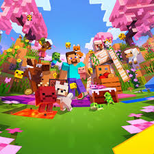

### 🌟 Play Minecraft directly in your browser — No download needed! 🌟

---

## ✨ Features
| 🌍 Minecraft 1.8 | 🎯 Multiplayer | 💻 No Install | 📱 PC & Laptop |
|---|---|---|---|
| Full gameplay | Online support | Just open & play | Works everywhere |

---

## 🎮 How to Play
> 1️⃣ Click the **PLAY NOW** button above
> 2️⃣ Wait for game to load
> 3️⃣ Enjoy! 🎉

---

⚠️ *Fan-made browser clone using EaglercraftX. Not affiliated with Mojang or Microsoft.*

